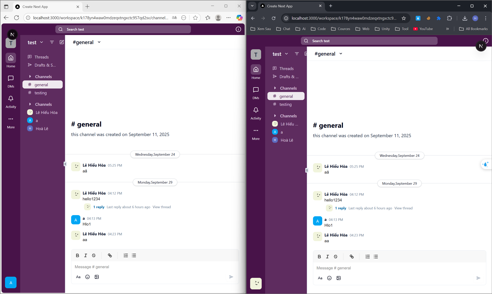
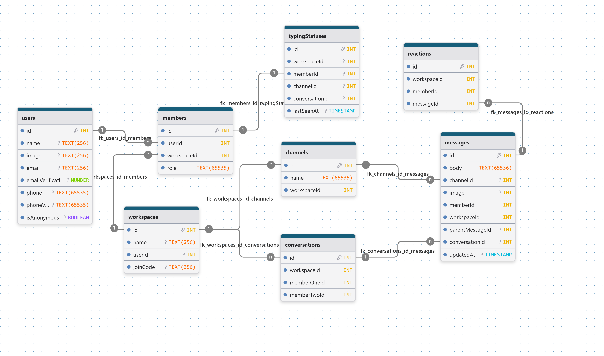

# Slack Clone



## 1. Project Overview

### Describe

Slack Clone is a real-time messaging app built with Next.js and Convex that mimics Slack's core features including workspaces, channels, direct messages, reactions, and threads.

### Tech stack

- **Framework**: Next.js 15.4.6 (React 19.1.0)
- **Backend**: Convex (Real-time Database & API)
- **Authentication**: Convex Auth with GitHub, Google and Password providers
- **Styling**: Tailwind CSS with Radix UI components (Shadcn)
- **State Management**: Jotai (via custom hooks)
- **Rich Text Editor**: Quill.js
- **Notifications**: Sonner
- **Icons**: Lucide React, React Icons
- **Date Handling**: date-fns
- **TypeScript**: full type safety

---

## 2. System Architecture

### 1. Folder Structure

```
slack-clone/
├── convex/                      # Convex backend
│   ├── _generated/              # Auto-generated types
│   ├── ai.ts                    # AI actions
│   ├── auth.ts                  # Authentication
│   ├── channels.ts              # Channel queries/mutations
│   ├── conversations.ts         # Conversation queries/mutations
│   ├── members.ts               # Member management
│   ├── messages.ts              # Message CRUD
│   ├── reactions.ts             # Reaction handling
│   ├── typing_statuses.ts       # Typing indicators
│   ├── upload.ts                # File upload
│   ├── users.ts                 # User management
│   ├── workspaces.ts            # Workspace management
│   ├── schema.ts                # Database schema
│   └── convex.config.ts         # Convex configuration
│
├── src/
│   ├── app/                     # Next.js App Router
│   │   ├── layout.tsx           # Root layout
│   │   ├── page.tsx             # Home page
│   │   ├── globals.css          # Global styles
│   │   ├── auth/                # Authentication pages
│   │   ├── join/[workspaceId]/  # Join workspace
│   │   └── workspace/[workspaceId]/
│   │       ├── layout.tsx       # Workspace layout
│   │       ├── page.tsx         # Workspace home
│   │       ├── sidebar.tsx      # Workspace sidebar
│   │       ├── channel/[channelId]/
│   │       │   ├── page.tsx     # Channel chat
│   │       │   ├── header.tsx
│   │       │   └── chat-input.tsx
│   │       └── member/[memberId]/
│   │           ├── page.tsx     # DM chat
│   │           └── chat-input.tsx
│   │
│   ├── components/              # Reusable components
│   │   ├── ui/                  # shadcn/ui components
│   │   ├── editor.tsx           # Rich text editor
│   │   ├── message.tsx          # Message component
│   │   ├── message-list.tsx     # Message list
│   │   ├── reactions.tsx        # Reaction UI
│   │   ├── typing-indicator.tsx # Typing status
│   │   └── ...
│   │
│   ├── features/                # Feature modules
│   │   ├── ai/
│   │   │   ├── api/
│   │   │   │   └── use-generate-content.ts
│   │   │   └── components/
│   │   │       └── ComposeAssistant.tsx
│   │   ├── auth/
│   │   │   ├── api/
│   │   │   └── components/
│   │   ├── channels/
│   │   ├── messages/
│   │   ├── reactions/
│   │   ├── typing-statuses/
│   │   └── workspaces/
│   │
│   ├── hooks/                   # Custom hooks
│   │   ├── use-typing-indicator.ts
│   │   ├── use-channel-id.ts
│   │   ├── use-workspace-id.ts
│   │   └── ...
│   │
│   └── lib/
│       └── utils.ts             # Utility functions
│
├── public/                      # Static assets
├── .env.local                   # Environment variables
├── next.config.ts               # Next.js config
├── tsconfig.json                # TypeScript config
├── tailwind.config.ts           # Tailwind config
└── package.json                 # Dependencies
```

### 2. Database



## Deployment

### 1. Environment Setup

#### Environment Variables

> [!NOTE]
> Config in file `.env`
>
> ```env
> NEXT_PUBLIC_CONVEX_URL=
> CONVEX_DEPLOY_KEY=
> ```

> [!IMPORTANT]
> Config in `dashboard.convex.dev`
>
> ```env
> AUTH_GITHUB_ID=
> AUTH_GITHUB_SECRET=
> AUTH_GOOGLE_ID=
> AUTH_GOOGLE_SECRET=
> GOOGLE_GENERATIVE_AI_API_KEY =
> ```

### 2. Run project

```bash
npm install
npm run dev    
```

### 3. Build Process

#### Production Build

```bash
npm run build    # Next.js production build
npx convex deploy # Deploy Convex functions
```

#### Deployment Platforms

- **Frontend**: Vercel in this [`link`](slack-clone-alpha-ten.vercel.app)
- **Backend**: Convex (managed)
- **File Storage**: Convex Storage
